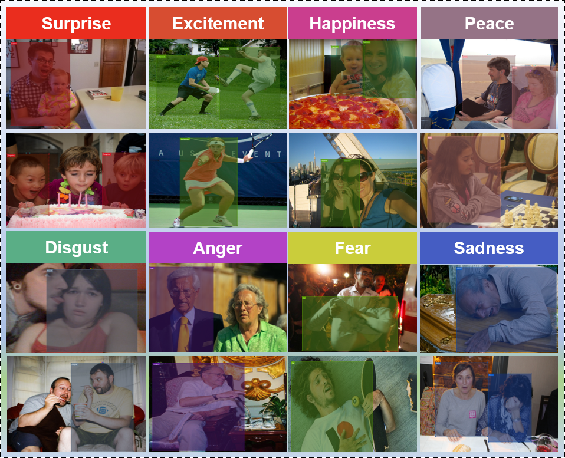
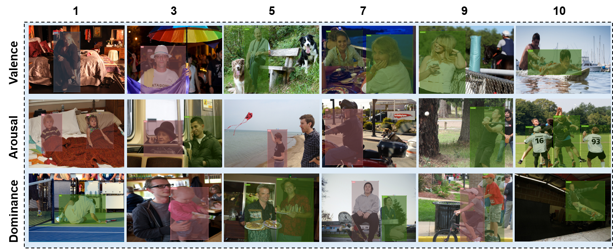

# 
Homepage for Human Emotion in COntext

## Introduction
HECO consists of images from the HOI datasets, film clips, and images from Google. The database contains a total number of 9,385 images and 19,781 annotated agents. Such image combination contains rich context information and diverse agent interaction behaviours. Concretely, the percentages of individual images containing one, two, and three or more agents annotated are about 20%, 28%, and 52%, respectively. 

 

Examples of the eight categories of discrete labels included in the HECO.

 

Examples of the recognized agents with difference scores of Valence (row 1), Arousal (row 2) and Dominance (row 3) included in the HECO.

# Download the source for HECO 
Researcher shall use  HECO  only for non-commercial research and educational purposes.

To download the dataset (images and annotations) please fill the form you will find here (the size of the dataset is approximately 3.2GB).

*NOTE: Some of the images in the HECO Dataset belong to the public datasets MSCOCO, Ade20k, and EMOTIC.*

Code and CNN Models
Code and trained models for both first and second EMOTIC dataset releases can be found [Here](http://www.baidu.com) .

Please email Ronak Kosti or Agata Lapedriza if you have any questions or comments.
