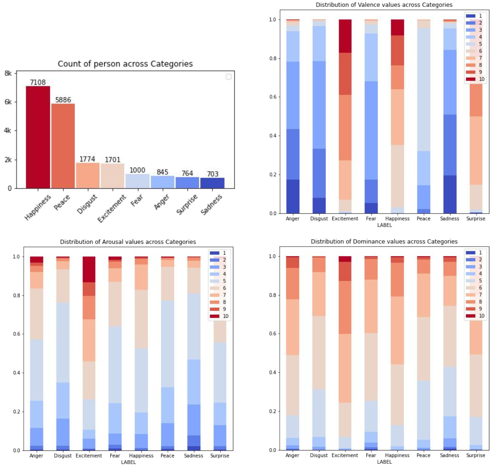
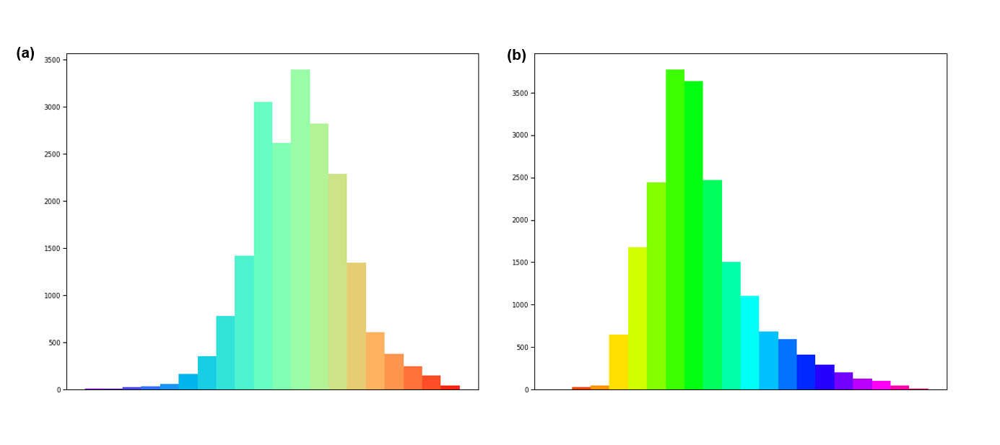

<!-- # 
Homepage for Human Emotion in COntext
 -->

# Introduction
HECO consists of images from the HOI datasets, film clips, and images from Google. The database contains a total number of 9,385 images and 19,781 annotated agents. Such image combination contains rich context information and diverse agent interaction behaviours. 

# Annotation
For **discrete categories**, we annotate with eight categories, including *Surprise*, *Excitement*, *Happiness*, *Peace*, *Disgust*, *Anger*, *Fear*, and *Sadness*.

 

Examples of the eight categories of discrete labels included in the HECO.

 

For **continuous dimensions**, we use the emotional state model of  VAD, and annotate the *Valence* (V), *Arousal* (A) and *Dominance* (D) of agents on a scale of 1-10. 
- *Valence* (V) measures how positive or pleasant an emotion is. 
- *Arousal* (A) measures the agitation level of the agent. 
- *Dominance* (D) measures the control level of the situation by the agent.

 

Examples of the recognized agents with difference scores of Valence (row 1), Arousal (row 2) and Dominance (row 3) included in the HECO.

 

Besides, we enforce numerical values to express relative percentages. Each category's count and the distribution of continuous dimensions across different categories are shown as follow.

 

Count and per each continuous dimension’s distribution of the scores across the different categories.

 

Inspired by emotion sociology, we propose two novel label spaces : *Self-Assurance* (***Sa***) and *Catharsis* (***Ca***). ***Sa*** refers to the level of confidence in the agent's ability and judgement, *i.e.*, the agent conveys feelings of competence and adequacy, representing the degree to which the agent understands emotion at the cognitive level.  ***Ca*** reflects the influence of change in emotion from the agents on interaction and situation.

(a) Distribution map of Sa.  (b) Distribution map of Ca.

#  Download the  HECO Dataset
Researcher should use  HECO  only for non-commercial research and educational purposes.

The dataset (images and annotations) is avaliable at  [here](https://drive.google.com/drive/folders/1js1UoaAeagrHZ5eizInw5ZaWLJurKW-D). Code is available at  [here](https://github.com/HECO2022/heco).

# Acknowledgements
This work is supported by National Key R&D Program of China (2021ZD0113502, 2021ZD0113503), Shanghai Municipal Science and Technology Major Project (2021SHZDZX0103) and National Natural Science Foundation of China under Grant (82090052)

